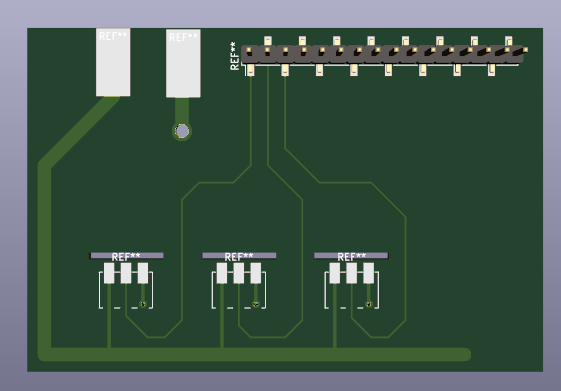

# Mini Tetris Board

Mainly the PCB design (WIP)

Example:

# Planing and ideas
Wir sollten den von KiCAD gedachten Weg nehmen, und mit den Schematics anfangen. Damit haben wir dann auch zumindest eine
Plausibilitätsprüfung für's Netz.

Idee für die Platine: vergrößern auf die Außenmaße des unteren Rahmens (der Kasten für die Elektronik), Bohrlöcher mit vorsehen.
Dann können wir es direkt mit dem Rest verschrauben. Aufpassen, dass im Rand kein Metall in den Layern ist, um elektrisch von außen
getrennt zu bleiben! Daten für Größe könnte man vermutlich aus den Laserdaten nehmen. Nachteil: Platine ist nur befestigt, wenn
der Rahmen zu ist.

# TODOs:
* Footprint für SMD-Shild Arduino Mega
* Footprint für SMD-Shild Raspi
* Stiftleisten oder ähnliches für alle Switches
    gute idee peer von damals
* ~~Dicke! Powerlines~~
* ~~SPI und ready line~~
* logic shifter 5V->3V3 für Leitungen Arduino->Raspi
* Status led leiste? Ist im Original ein weitere strip
* Wollen wir LAN nach draußen legen? Oder USB vom Raspi?
* DeepCyber Logo auf Platine!
* Name, revision, url des repos auf platine

# Löten?
Ich höre, JLCPCB macht einseitige Bestückung für Bauteile, die sie haben. Da wir nur Stift- und Buchsenleisten haben, könnte das was werden.

